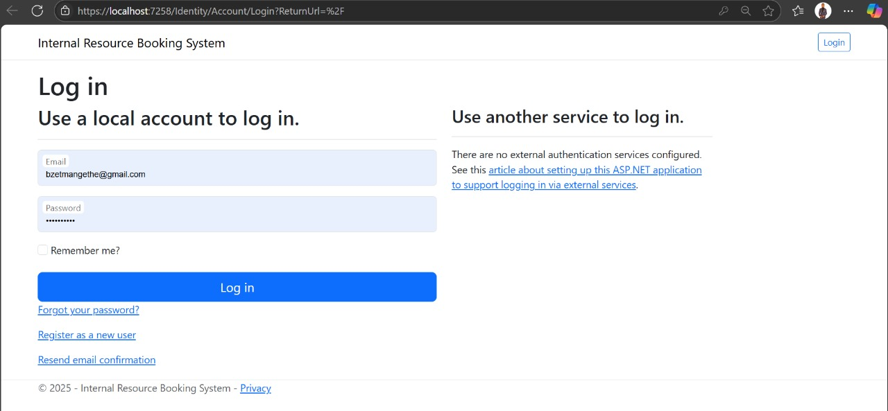
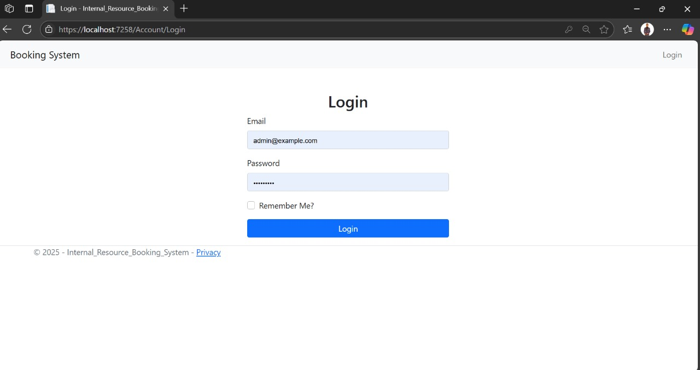
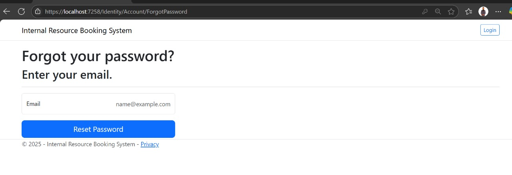
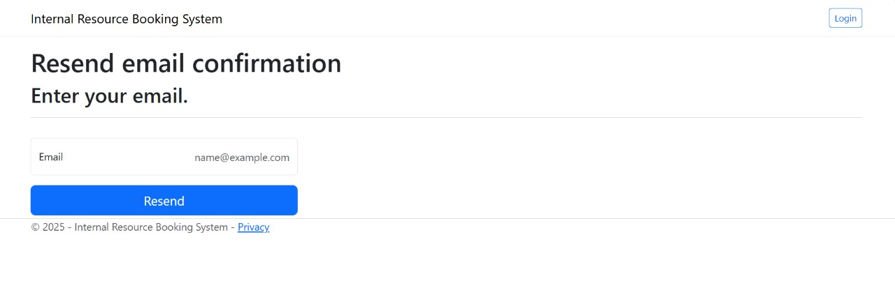
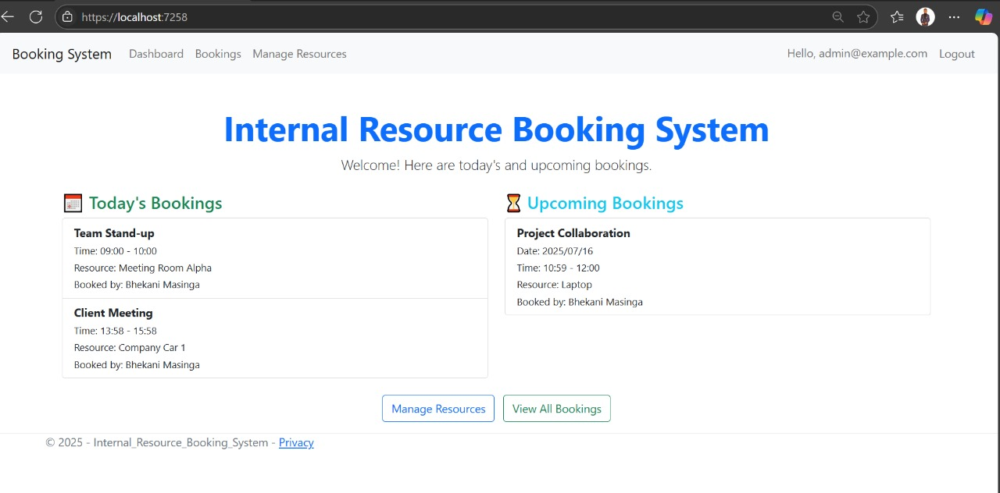
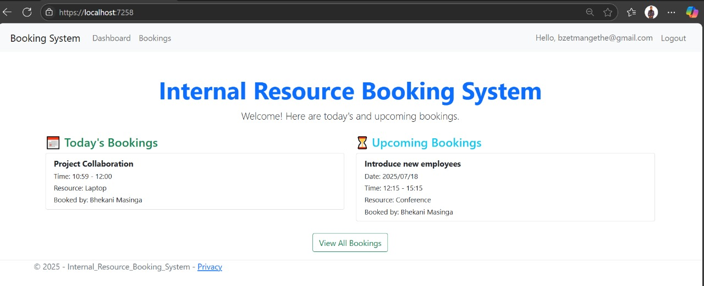
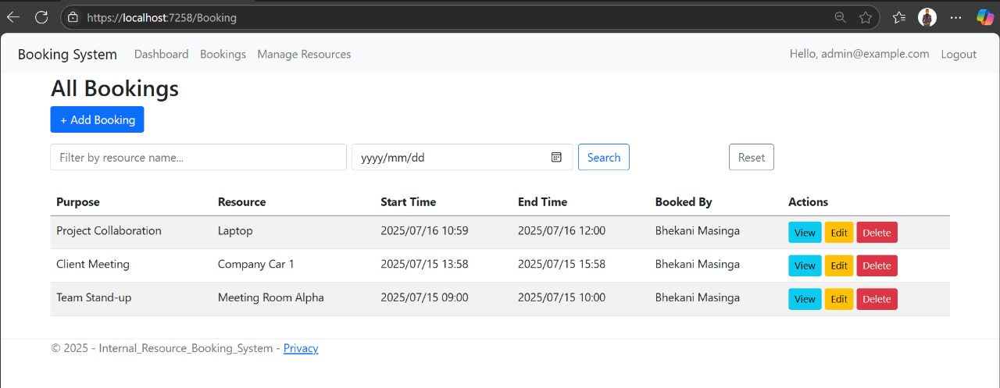
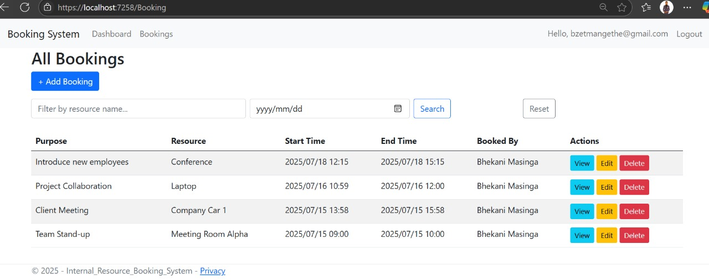
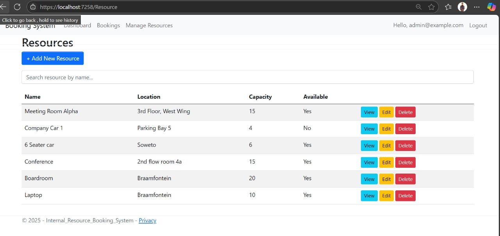

# 🏢 Internal Resource Booking System (ASP.NET Core MVC)

This is a web-based booking system built using **ASP.NET Core MVC** and **Entity Framework Core**. It allows users to book internal resources (e.g., rooms, company cars).

---
## 💬 Author
Name  : Bhekani Masinga || 
Email : bamasingahbhekanie@gmail.com || 
GitHub: github.com/yourusername

## 🔐 Features

- ✅ User Login (ASP.NET Core Identity)
- 👤 User Registration
- 👤 Role-based access: **Admin** & **Aser**
- 📆 Book resources with **conflict checking**
- 📋 Filter bookings by **resource name** and **date**
- 🧑‍💼 Admin can manage **Resources** and **Bookings**
- 🧑‍💼 Other users can manage **Bookings**


---

## 🧪 Screenshots

### 🧑‍ Registration


### 🔐 1st Time Login


### 🔐 Login


### 🔐 Reset Password


### 🔐 Resed Email


### 🏠 Admin Dashboard



## 🏠 User Dashboard


### 📝 Admin Booking Form


### 📝 User Booking Form


### 🧑‍💼 Admin - Manage Resources



## 💻 Tech Stack

- ASP.NET Core MVC (.NET 6 or 7)
- Entity Framework Core
- SQL Server (LocalDB)
- ASP.NET Core Identity
- Bootstrap 5

---

## 🚀 How to Run

1. Clone or unzip the project.
2. Open in **Visual Studio 2022 or higher**
3. Open Package Manager Console and run below:
    ```
    Update-Database
    dotnet ef database update
    ```
4. Run the project (`F5` or `Ctrl + F5`)
5. log in with the seeded admin

---

## 👑 Default Admin Credentials


Email: admin@example.com
Password: Admin@123
